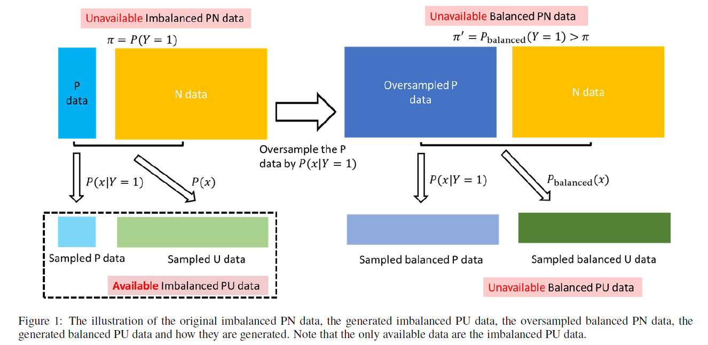
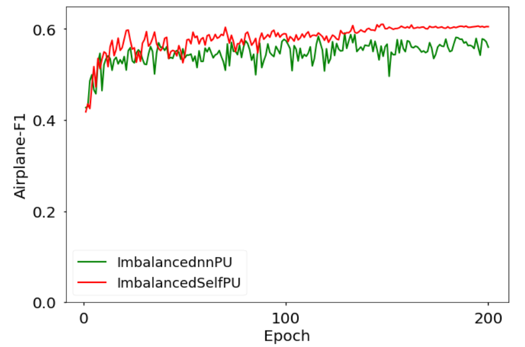

# ImbalancedPU
Code for the paper named ["Positive-Unlabeled Learning from Imbalanced Data"](https://github.com/214159537/ImbalancedPU)[1] which has been accepted by IJCAI-21. In this paper, we propose a general learning objective for PU learning targeting specially at imbalanced data which named ImbalancedPU.



## Requirements
* Pytorch 1.7
* Python 3
* CUDA 11.1

## Preparing data
* For ImbalancedSelfPU, you need to download CIFAR10 [3] and exact it into ```cifar/ ```.
* Related blank folders also should be added as code shown.

There are two folders named "ImbalancedSelfPU" and "ImbalancednnPU" which involve the methods that the paper compared: 

## ImbalancedSelfPU

This framework combines our proposed method named ImbalancedPU and the framework depends on the Self-PU [2] which uses the additional labeled data in a meta-learning fashion and other “self”-oriented building blocks.

* ```util.py``` The related ImbalancedPU loss functions are written here which are changed based on the Self-PU  [2] public code.

* ```train_with_meta.py``` This is an example code of ImbalancedSelfPU. 
CIFAR10 [3] dataset is preprocessed in such a way that only one label is used as positive data and the remaining data are regarded as negative. 
The default setting is 1000 P data and 50000 U data of CIFAR10, and the class prior is the ratio of P class data in U data.

## ImbalancednnPU

ImbalancednnPU is developed based on the state-of-the-art method nnPU [4] . We use the same network structure and the recommended parameter tuning strategy as the original paper (nnPU) said. Specially, there is no additional labeled data used here.

* ```unbal_loss.py``` The related ImbalancedPU loss functions are written here which are changed based on the nnPU [4] public code.

* ```train_without_meta.py``` This is an example code of ImbalancednnPU. 
CIFAR10 [3] dataset is preprocessed in such a way that only one label is used as positive data and the remaining data are regarded as negative. 
The default setting is 1000 P data and 50000 U data of CIFAR10, and the class prior is the ratio of P class data in U data.


## Sample results as default setting we provided


## Average F1 score in 200 epochs
| Name| Average F1 score |
| ---- | ---- | 
| ImbalancedSelfPU | 0.5797 | 
| ImbalancednnPU | 0.5476 | 

## Reference

[1] our paper

[2] X. Chen et al., "Self-pu: Self boosted and calibrated positive-unlabeled training," in International Conference on Machine Learning, 2020: PMLR, pp. 1510-1519. 

[3] Learning Multiple Layers of Features from Tiny Images, Alex Krizhevsky, 2009.

[4] R. Kiryo, G. Niu, M. C. d. Plessis, and M. Sugiyama, "Positive-unlabeled learning with non-negative risk estimator," arXiv preprint arXiv:1703.00593, 2017.
